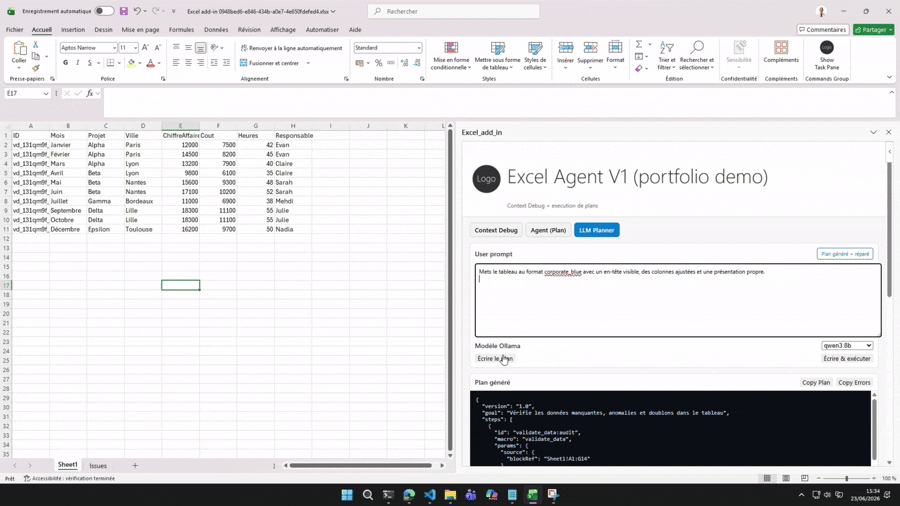

# Excel Agent POC - Controlled Office.js Automation for Excel

A local-first Office.js Excel add-in that shows how an AI assistant can act on workbook data without becoming a free-form workbook script generator. The model proposes intent, but the app keeps execution under a strict contract: workbook snapshot -> JSON plan -> validation and normalization -> human confirmation when needed -> deterministic Office.js macros.

## Short Pitch

This project demonstrates a spreadsheet agent built for control, not demo theater. It turns a workbook context snapshot and a user request into a validated execution plan, then runs only a known set of macros. That makes the add-in useful for a portfolio because it combines AI, product thinking, and practical runtime safety.

## Demo Preview

<p align="center">
  <a href="https://github.com/Evan-Rouzaud-git/excel-agent-poc/releases/tag/demo-v1">
    
  </a>
</p>

<p align="center">
  <a href="https://github.com/Evan-Rouzaud-git/excel-agent-poc/releases/tag/demo-v1">
    <strong>Watch the full 1 min 15 demo video</strong>
  </a>
</p>

The short preview shows the main workflow: data quality audit, controlled table formatting with the `corporate_blue` preset, margin formula generation, and chart creation from workbook data.

## Demo Overview

The validated Excel demo covers four realistic tasks:

1. Audit missing values, anomalies, and duplicates in a table.
2. Apply the corporate_blue formatting preset.
3. Add a Marge column calculated from ChiffreAffaires - Cout.
4. Create a chart of ChiffreAffaires by Mois.

The demo prompts are intentionally written in French because the original target environment used French Excel and French-speaking business users. The repository documentation stays in English for GitHub readability. See [docs/demo.md](docs/demo.md) for the dataset and exact prompts.

## What the Project Does

- Captures a workbook context snapshot before planning.
- Optionally sends that snapshot to a local LLM planner through Ollama.
- Produces a strict JSON execution plan instead of free-form code.
- Normalizes, sanitizes, and repairs the plan before execution.
- Validates the plan with AJV and additional invariants.
- Requests human confirmation for risky actions.
- Executes workbook mutations through controlled Office.js macros only.
- Emits logs and artifacts so the run can be inspected.
- Runs automated tests against a fake Excel environment.

## Why This Project Matters

- It is not just an LLM wrapped in a UI. The useful work is the execution contract between planner and executor.
- The model never writes to Excel directly. It can only propose a plan.
- Validation and sanitization are the core engineering layer that keeps the workflow understandable.
- The project is a POC, not a production platform, but it demonstrates the kind of control you want in spreadsheet automation.

## Key Features

- Office.js Excel add-in with a TypeScript codebase.
- Workbook context snapshot used as planner input.
- Optional Ollama-backed planner for local-first demos.
- Strict JSON plan validated with AJV.
- Plan normalization and sanitization before execution.
- Human confirmations for risky or ambiguous actions.
- Deterministic executor with a fixed macro surface.
- Logs and artifacts exposed by the runtime.
- Fake Excel host for reproducible automated tests.
- Example evaluation report committed for review.

## Architecture Overview

The runtime follows a controlled pipeline:

`workbook snapshot -> planner -> normalize -> sanitize -> repair -> validate -> confirmations -> execute -> logs/artifacts`

For the full technical breakdown, see [docs/architecture-and-pipeline.md](docs/architecture-and-pipeline.md).

## Safety and Control Principles

- No VBA.
- No unrestricted execution.
- No direct workbook writes from the LLM.
- Only known macros can mutate the workbook.
- Destructive or ambiguous actions require confirmation.
- The demo is local-first and does not need a remote backend.
- Automated tests run without a live Excel session.

## Tech Stack

- Office.js for Excel integration.
- TypeScript for the add-in and agent logic.
- AJV for JSON schema validation.
- Ollama for optional local planning.
- Jest for automated tests.
- Webpack for bundling and sideloading.
- A fake Excel host for tests and demo evaluation.

## Repository Structure

```text
src/
  taskpane/
    context/        workbook snapshot and types
    agent/          planner, executor, macros, validation, confirmations
    taskpane.ts     UI wiring
tests/
  mocks/            fake Excel host
  fixtures/         workbook snapshots and demo data
prompts/
  demo_prompts.json scripted demo and evaluation prompts
docs/
  architecture-and-pipeline.md  technical deep dive
  demo.md                       reproducible demo guide
  evaluation/
    demo_eval_report.example.json example evaluation artifact
assets/           add-in static assets
manifest.xml      Office add-in manifest
webpack.config.js bundling configuration
```

## Installation

Prerequisites:

- Node.js 18 or newer
- Excel desktop for the real add-in demo
- Ollama only if you want to exercise the live planner path

Install dependencies:

```bash
npm ci
```

`npm run dev-server` is optional. It is useful when you want a separate webpack dev server, but it is not required to run the add-in end to end.

## Run Tests

```bash
npm test
```

This validates the automated logic, including plan normalization, sanitization, schema checks, executor behavior, and the fake Excel host. The test suite can run in mock mode and does not require Excel or Ollama.

```bash
npm run build
```

This verifies that the TypeScript code compiles and the add-in bundles correctly.

## Run the Excel Add-in Locally

```bash
npm start
```

This launches the Office.js debugging flow against `manifest.xml` and opens Excel locally.

If you want live webpack recompilation during development, you can also run:

```bash
npm run dev-server
```

That is a convenience option, not a requirement.

## Demo Scenario

Recommended sequence:

1. Audit the table with `validate_data`.
2. Apply the `corporate_blue` preset.
3. Add the `Marge` column.
4. Create the `ChiffreAffaires` by `Mois` chart.

This sequence is documented in [docs/demo.md](docs/demo.md). It shows the full control loop: inspect first, then format, then compute, then visualize.

## Evaluation

The repository includes a synthetic example evaluation report at [docs/evaluation/demo_eval_report.example.json](docs/evaluation/demo_eval_report.example.json). It captures the shape of a demo run without requiring a live rerun.

The project has also been validated locally:

- `npm ci`
- `npm test`
- `npm run build`
- `npm start`

## Limitations

- The planner still depends on prompt quality and workbook context quality.
- Office.js behavior can vary by host and workbook state.
- The macro surface is intentionally narrow, which limits flexibility but improves control.
- The workbook snapshot is useful, but it is still a snapshot rather than a full semantic model of Excel.
- The fake Excel host improves testability, but it cannot reproduce every live Office.js edge case.

## Next Improvements

- Broader macro coverage for additional workbook tasks.
- Stronger planner prompts and plan repair heuristics.
- More workbook fixtures and edge cases in the fake Excel host.
- Additional demo and evaluation scenarios.
- Richer artifact inspection in the taskpane UI.
- Optional CI automation for test and build validation.

## Portfolio Note

This repository is meant to show how AI, Office.js, TypeScript, validation, confirmations, logs, tests, and security constraints can fit together in a way that is easy to review.

The main signal is not that the app can talk to Excel. The main signal is that it can turn workbook context into controlled actions with a clear execution contract.
